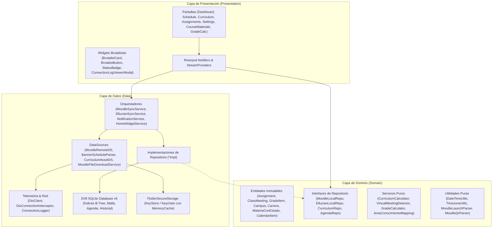
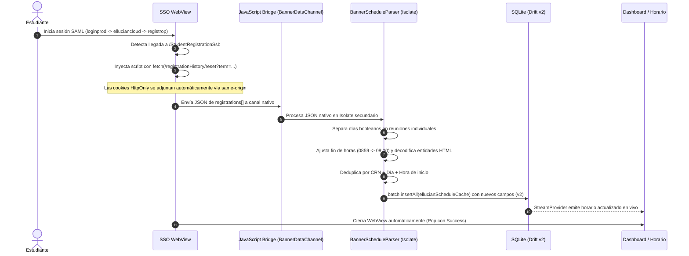
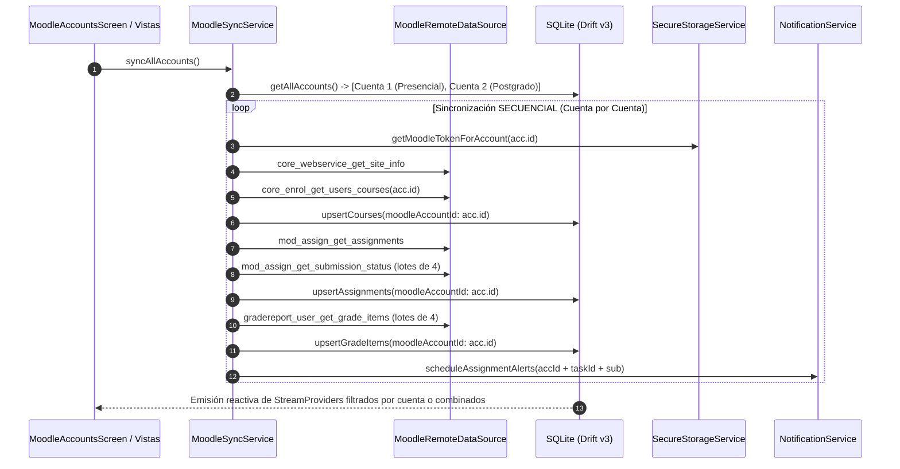
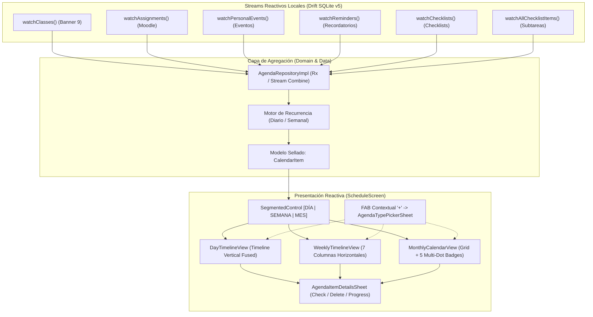

# 🏛️ Arquitectura de Software de Esperancitos

## 1. Visión General y Principios de Diseño

Esperancitos sigue los principios de **Clean Architecture** estructurada por características (*feature-first*), garantizando desacoplamiento estricto entre la interfaz visual, las reglas de negocio y los mecanismos de persistencia o red.

### Principios Clave:
1. **Regla de Dependencia:** La capa de Dominio (`domain/`) no tiene dependencias de Flutter, Drift, Dio ni librerías de terceros; solo define entidades inmutables y contratos abstractos de repositorios y servicios.
2. **Offline-First Real:** Las vistas de Moodle y de Horario nunca se bloquean esperando respuesta de la red; observan streams continuos emitidos por SQLite vía Drift (`watch()`).
3. **Flujo Híbrido SAML para Banner 9:** Autenticación federada segura en un WebView interactivo; una vez en la sesión de registro, un script inyectado ejecuta un `fetch()` con `credentials: 'same-origin'` para extraer el JSON nativo directamente de `/StudentRegistrationSsb/ssb/registrationHistory/reset?term=$term`, transmitiéndolo de vuelta por un puente JavaScript (`BannerDataChannel`) a Flutter.
4. **Moodle SSO vía `launch.php`:** Autenticación institucional integrada mediante `{baseUrl}/admin/tool/mobile/launch.php`, interceptando el protocolo `moodlemobile://token=<base64>` para capturar el token sin requerir contraseñas en claro.
5. **Multi-Campus Aislado:** Moodle soporta 4 campus institucionales independientes (`micampus`, `micampusvirtual`, `micampus2`, `micampus1`). El cambio de campus purga de forma atómica las tablas de Moodle sin alterar la sesión ni el horario de Banner.
6. **Manejo de Errores Tipado (`Result<T>`):** Prohibición de excepciones no controladas en capas de negocio. Se emplea un tipo sellado `Result<T>` (`Success<T>` o `Failure<T>`) para pattern matching exhaustivo.

---

## 2. Diagrama General de Capas

---

## 3. Flujo de Autenticación y Extracción de Banner 9 (Ellucian)

Debido a que Banner 9 implementa autenticación federada SAML entre múltiples dominios institucionales (`loginprod.espe.edu.ec`, `*.elluciancloud.com` y `registrop.espe.edu.ec`), la aplicación utiliza un WebView controlado con intercepción JavaScript interna.

---

## 4. Arquitectura Multi-Cuenta y Sincronización de Moodle

A partir de la versión 3 (`schemaVersion = 3`), Esperancitos implementa soporte **Multi-Cuenta nativo para Moodle**, permitiendo vincular múltiples cuentas institucionales simultáneas (ej. Pregrado Presencial y Postgrado, o dos campus distintos) sin que conectar una sobreescriba los datos de otra. **Banner 9 se mantiene estrictamente como cuenta única institucional.**

### Reglas Arquitectónicas Multi-Cuenta:
1. **Aislamiento Estricto por `moodleAccountId`:** Cada curso, tarea y nota almacena la clave foránea `moodleAccountId`. Las consultas locales y la eliminación de una cuenta se acotan a su `accountId` sin afectar a otras cuentas ni a la sesión de Banner.
2. **Sincronización Secuencial (`syncAllAccounts`):** Las cuentas se sincronizan en bucle secuencial, previniendo saturación de red y mezcla de tokens en memoria.
3. **Notificaciones con ID Compuesto de 32 bits:** Para evitar colisiones entre cuentas que tengan IDs numéricos idénticos de tarea en Moodle, el ID de notificación se computa:
   $$\text{notifId} = (\text{accountId} \times 1\,000\,000) + (\text{taskMoodleId} \times 10) + \text{subAlertIndex}$$
   Al eliminar una cuenta, se cancelan exclusivamente sus alertas programadas.
4. **Cuenta Principal (`isPrimary`), Home Widget y Resumen Matutino:**
   * Una sola cuenta de Moodle puede estar marcada con `isPrimary = true`.
   * El **Home Widget** y el **Morning Briefing** leen tareas exclusivamente de la cuenta principal (`moodlePrimaryAssignmentsStreamProvider`).
   * Si no hay ninguna cuenta conectada (0 cuentas), se degradan limpiamente mostrando solo el horario de Banner y el mensaje *"Sin cuenta conectada"*.
5. **Vistas de Tareas y Notas:**
   * Muestran un selector interactivo de cuentas (Filter Chips) si hay 2 o más cuentas conectadas; el chip se oculta si hay $\le 1$ cuenta.
   * En la vista combinada ("Todas"), cada tarjeta incluye una insignia con el nombre del campus de origen.

---

## 5. Arquitectura del Calendario y Agenda Escolar Unificada (v1.5.0)

A partir de la versión **1.5.0**, el módulo de Horario evoluciona hacia una **Agenda Escolar Unificada** que integra tres fuentes de datos en un solo pipeline reactivo:
1. **Horario Institucional (Banner 9):** Clases semanales recurrentes (`EllucianScheduleCache`).
2. **Tareas y Evaluaciones (Moodle):** Entregas académicas con fecha límite (`Assignments`).
3. **Elementos Personales del Estudiante:** Eventos, recordatorios y listas de tareas personalizadas creadas de forma 100% offline.

### 5.1 Jerarquía Sellada de Dominio: `CalendarItem`
El modelo de datos unificado utiliza clases selladas (`sealed class CalendarItem`) para garantizar pattern matching exhaustivo sin casting dinámico:

| Subclase | Origen | Color Brutalista | Icono | Campos Clave |
| :--- | :--- | :--- | :--- | :--- |
| **`ClassMeetingItem`** | Banner 9 | Esmeralda (`#00FF87`) | `school_rounded` | NRC, materia, aula, profesor, horario inicio-fin |
| **`AssignmentItem`** | Moodle | Azul Cielo (`#38BDF8`) | `assignment_rounded` | Curso, nombre, fecha límite, estado de entrega |
| **`PersonalEventItem`** | Usuario | Morado Eléctrico (`#A855F7`) | `event_rounded` | Inicio-fin, todo el día, recurrencia, color personalizado |
| **`ReminderItem`** | Usuario | Ámbar (`#FBBF24`) | `notifications_active_rounded` | Fecha puntual, repetición, estado completado |
| **`ChecklistItem`** | Usuario | Coral (`#FB7185`) | `checklist_rounded` | Subtareas, progreso visual (ej. "3/5"), completitud |

### 5.2 Motor de Agregación y Proyección de Recurrencia
`AgendaRepositoryImpl` unifica los 6 streams de SQLite y proyecta los elementos recurrentes:
- **Eventos con repetición diaria o semanal:** Se replican dinámicamente sobre la ventana de tiempo consultada respetando la hora original.
- **Normalización de Fechas:** Todas las claves de indexación del mapa de eventos mensual (`Map<DateTime, List<CalendarItem>>`) se normalizan a medianoche UTC (`DateTime.utc(year, month, day)`), permitiendo búsquedas instantáneas $O(1)$ en el calendario mensual.

### 5.3 Sistema de Notificaciones y Alarmas Exactas
El `NotificationService` se extiende para soportar alertas personalizadas con selección múltiple de tiempos (en el momento, 5m, 15m, 30m, 1h, 1d antes):
- **Exact Alarms (Android 12+):** Utiliza `androidScheduleMode: exactAllowWhileIdle` si la app cuenta con permiso `SCHEDULE_EXACT_ALARM` o `USE_EXACT_ALARM`.
- **Degradación Segura (Fallback):** Si el usuario niega o revoca el permiso de alarmas exactas en ajustes del sistema, el servicio captura la excepción y programa automáticamente en modo `inexactAllowWhileIdle`.
- **Aislamiento de Identificadores (32 bits):**
  - Moodle: `(accId * 1_000_000) + (taskId * 10) + sub`
  - Eventos Personales: `70_000_000 + (eventId % 100_000 * 10) + offsetIndex`
  - Recordatorios: `80_000_000 + (reminderId % 100_000 * 10) + offsetIndex`
- **Limpieza Automática:** Al editar o eliminar un evento o recordatorio, sus alertas asociadas en el sistema operativo se cancelan inmediatamente.

---

## 6. Esquema de Base de Datos Local (Drift SQLite v5)

La base de datos local gestiona el almacenamiento estructurado y reactivo con `schemaVersion = 5`:

1. **`MoodleAccounts` (v3):** Cuentas institucionales conectadas.
2. **`MoodleCourses`:** Cursos matriculados por cuenta.
3. **`Assignments`:** Tareas y cuestionarios con fecha de entrega.
4. **`GradeItems`:** Calificaciones parciales.
5. **`EllucianScheduleCache`:** Horario institucional extraído de Banner 9.
6. **`BannerAcademicHistory` (v3):** Historial académico acumulado de periodos previos.
7. **`PersonalEvents` (Nueva en v5):**
   * `id`: Entero autoincremental (Clave Primaria).
   * `title`: Texto con título del evento.
   * `description`: Texto opcional descriptivo.
   * `startDateTime` / `endDateTime`: Fechas/horas de inicio y fin.
   * `location`: Texto opcional con aula o lugar.
   * `colorValue`: Entero con valor ARGB del color elegido.
   * `isAllDay`: Booleano para eventos de día completo.
   * `recurrence`: Enum en texto (`none`, `daily`, `weekly`).
   * `remindersJson`: Lista codificada en JSON con recordatorios anticipados en minutos.
   * `createdAt`: Timestamp de creación.
8. **`PersonalReminders` (Nueva en v5):**
   * `id`: Entero autoincremental (Clave Primaria).
   * `title`: Texto del recordatorio.
   * `description`: Texto opcional.
   * `dueDateTime`: Fecha y hora exacta programada.
   * `isCompleted`: Booleano del estado de completado.
   * `recurrence`: Enum en texto (`none`, `daily`, `weekly`).
   * `remindersJson`: Tiempos de alerta en formato JSON.
   * `createdAt`: Timestamp de creación.
9. **`UserChecklists` (Nueva en v5):**
   * `id`: Entero autoincremental (Clave Primaria).
   * `title`: Nombre de la lista.
   * `description`: Descripción opcional.
   * `dueDateTime`: Fecha límite opcional para la lista.
   * `createdAt`: Timestamp de creación.
10. **`UserChecklistItems` (Nueva en v5):**
    * `id`: Entero autoincremental (Clave Primaria).
    * `checklistId`: Clave foránea con eliminación en cascada hacia `UserChecklists.id`.
    * `title`: Texto de la subtarea.
    * `isCompleted`: Booleano del checkbox.
    * `dueDateTime`: Fecha límite puntual opcional.
    * `sortOrder`: Entero para ordenamiento manual.
11. **`CarreraSeleccionada` (Nueva en v6):**
    * `id`: Entero autoincremental (Clave Primaria).
    * `carreraNombre`: Nombre oficial de la carrera seleccionada por el estudiante.
    * `archivoJson`: Nombre del archivo JSON asociado en `assets/mallas/` (ej. `SchoIA_Reporte_software.json`).
    * `fechaSeleccionada`: Timestamp de la última selección o cambio.
12. **`MateriaAprobada` (Nueva en v6):**
    * `id`: Entero autoincremental (Clave Primaria).
    * `codigoMateria`: Código único de la materia aprobada (ej. `COMPA0401`).
    * `fechaAprobado`: Timestamp en el que el usuario marcó la materia como aprobada.
13. **Índices Secundarios B-Tree (v6):**
    * `idx_assignments_sub_due`: `assignments (is_submitted, due_date)`
    * `idx_assignments_course`: `assignments (course_id)`
    * `idx_assignments_account`: `assignments (moodle_account_id)`
    * `idx_grade_items_course`: `grade_items (course_id)`
    * `idx_grade_items_account`: `grade_items (moodle_account_id)`
    * `idx_moodle_courses_account`: `moodle_courses (moodle_account_id)`
    * `idx_ellucian_day_time`: `ellucian_schedule_cache (day_of_week, start_time)`
    * `idx_personal_events_start`: `personal_events (start_date_time)`
    * `idx_personal_reminders_due`: `personal_reminders (due_date_time)`
    * `idx_checklist_items_parent`: `user_checklist_items (checklist_id)`
    * `idx_materias_aprobadas_codigo`: `materia_aprobada (codigo_materia)`

---

## 7. Mapeo de Módulos del Proyecto

### `lib/core/`
* **`database/`:** `tables.dart` define las tablas de Drift v6. `app_database.dart` implementa `GeneratedDatabase` con migraciones automáticas (`_migrateSchemaV5ToV6`), consultas transaccionales e índices B-Tree.
* **`error/`:** Clases selladas `Result<T>` y jerarquía de `AppFailure` para control estricto de errores.
* **`network/`:** `dio_client.dart` con interceptores seguros que impiden el registro de contraseñas, tokens o cookies en logs.
* **`storage/`:** `secure_storage_service.dart` encapsula almacenamiento cifrado en Android Keystore e iOS Keychain con caché en memoria (`_memoryCache`).
* **`notifications/`:** `notification_service.dart` para alertas locales escalonadas, alarmas exactas para eventos/recordatorios personales, y notificaciones de notas nuevas.
* **`services/`:** `home_widget_service.dart` (proyección de próxima clase al widget nativo) y `morning_briefing_service.dart` (resumen diario 06:30 AM).
* **`providers/`:** `theme_provider.dart` (`AppThemeMode`: Oscuro Slate, Deep Negro OLED con migración automática y transparente desde modos obsoletos) y `hide_smowl_provider.dart` (filtro reactivo persistente en SharedPreferences para ocultar el curso tutorial de Smowl).
* **`router/`:** `app_router.dart` con `GoRouter 18` y `ShellRoute` para persistir el estado de pestañas (Hoy, Horario, Malla, Tareas, Ajustes) con resolución dinámica de paleta.
* **`theme/`:** `app_theme.dart`, `app_theme_mode.dart`, `app_theme_palette.dart`, `app_colors.dart` y `app_text_styles.dart` utilizando fuentes locales empaquetadas (`Outfit-Variable.ttf` e `Inter-Variable.ttf`) y soporte exclusivo para 2 temas oscuros de alto contraste (Oscuro Slate y Deep Negro OLED).
* **`utils/`:** `timezone_utils.dart` (Ecuador GMT-5), `date_time_utils.dart` (días y minutos), `ics_generator.dart` (RFC 5545 en Isolate) y `virtual_meeting_detector.dart` (regex para Teams/Zoom/Meet).
* **`widgets/`:** Sistema de diseño Neo-Student Brutalism (`BrutalistCard`, `BrutalistButton`, `StatusBadge`, `CardHeaderWithBadge`, `AppHeader`, `AssignmentCard`) optimizados con `RepaintBoundary` e integración háptica táctil.

### `lib/features/`
* **`task_alarm/` (Alarma de Tareas - FEAT-17):**
  * `domain/`:
    * `entities/task_alarm_settings.dart`: Entidad inmutable con switch booleano `enabled` (apagado por defecto) y anticipación de disparo (`leadTime`: 30m, 1h, 3h, 6h, 12h, 24h o personalizada $\ge 5$m con validación estricta y serialización JSON).
    * `services/alarm_api_client.dart`: Interfaz abstracta que encapsula la API nativa de `alarm` para permitir aislamiento y testing unitario sin dependencias de plataforma.
  * `data/services/task_alarm_scheduler.dart`: Orquestador desacoplado de alarmas nativas. Calcula el instante de disparo `fireAt = dueDate - leadTime` respetando estrictamente la zona horaria ecuatoriana (`TimezoneUtils`), deriva un ID int32 positivo estable y determinista a partir del `moodleId` de la tarea, filtra las ~20 tareas pendientes más próximas para evitar saturación del sistema y reprograma de manera 100% idempotente.
  * `presentation/`:
    * `providers/task_alarm_provider.dart`: Notifiers de Riverpod para sincronizar el estado reactivo de las alarmas con `SecureStorageService`.
    * `widgets/task_alarm_setting_tile.dart`: Componente UI Neo-Brutalista incrustable en Ajustes y Onboarding con selector de anticipación, diálogo explicativo para permisos de alarmas exactas en Android 14+ y aviso de optimización de batería.
    * `screens/alarm_ring_screen.dart`: Pantalla completa interactiva (`USE_FULL_SCREEN_INTENT`) que se despliega al dispararse la alarma, con audio en bucle, vibración y tres acciones directas: Detener, Posponer 10 min y Ver tarea (navegación declarativa a `/assignments`).
  * **Flujo de Integración:**
    - Reprogramación automática (`rescheduleAll()`): tras cada sincronización exitosa de Moodle, tras cambios en los conmutadores de configuración y tras marcar tareas completadas/incompletas vía swipe.
    - Cancelación total atómica (`stopAll()`): ejecutada de inmediato durante el cierre de sesión seguro y el cambio de campus.
* **`curriculum/` (Característica "Mi Malla" - 23 Carreras ESPE):**
  * `domain/entities/`:
    * `materia.dart`: Entidad pura que preserva códigos y nombres originales sin alterar casing, créditos, semestre y campo `prerrequisitos`.
    * `carrera.dart`: Modelo de carrera con parsing seguro de créditos totales, año estimado de graduación y flag `isDisponible`.
    * `area_conocimiento.dart`: Enum de 12 áreas de conocimiento con paleta de color adaptativa claro/oscuro.
    * `materia_con_estado.dart`: Entidad unificada que combina materia estática con estado de usuario (`isAprobada`, `isDisponible`, `isRutaCritica`, área).
    * `curriculum_progress.dart`: Métricas consolidadas de avance (% de avance, créditos aprobados/totales, año estimado de graduación).
  * `domain/repositories/`: `curriculum_repository.dart` (contrato abstracto).
  * `domain/services/`: `curriculum_calculator.dart` (motor de cálculo puro: desbloqueo de semestre $N-1$, regla estricta para hitos de titulación, detección de ruta crítica y agregación de progreso).
  * `data/`:
    * `area_conocimiento_mapping.dart`: Mapeo heurístico de prefijos a áreas de conocimiento, detección de hitos de titulación y fallback seguro a gris neutro ("Sin clasificar").
    * `datasources/curriculum_asset_data_source.dart`: Carga concurrente paralela mediante `Future.wait(...)` de los 23 JSONs (<80ms) y caché indexada en memoria $O(1)$ con `_cachedByFilename`. Descubrimiento dinámico vía `AssetManifest` sin requerir enums hardcodeados y con tolerancia a archivos vacíos.
    * `repositories/curriculum_repository_impl.dart`: Fusión reactiva en streaming entre catálogo estático de assets y base de datos Drift SQLite v6.
  * `presentation/`:
    * `providers/curriculum_providers.dart`: Notifiers y StreamProviders de Riverpod para filtros (solo disponibles, ruta crítica, búsqueda, toggle grid/lista) y estado de malla activa.
    * `screens/`: `curriculum_screen.dart` (pantalla principal de Mi Malla) y `carrera_selection_screen.dart` (buscador y selector brutalista de carreras).
    * `widgets/`: `curriculum_progress_header.dart` (header brutalista aislado con `RepaintBoundary`), `curriculum_subject_card.dart` (tarjetas aisladas con `RepaintBoundary` y retroalimentación háptica), `curriculum_semester_grid.dart` y `curriculum_list_view.dart` (con claves estables `ValueKey(item.codigo)` para optimización a 60/120 FPS), `curriculum_area_legend.dart` (leyenda colapsable) y `curriculum_subject_detail_sheet.dart` (detalle y toggle háptico de aprobación).
* **`auth/`:** Splash Screen optimizado (<700ms), Onboarding interactivo y `SsoWebViewScreen` con intercepción y canal JS para Banner 9.
* **`dashboard/`:** Visualización reactiva de clase activa, próxima clase con pulso aislado, atajo a Teams/Zoom, tarjeta de fin de jornada y carrusel de tareas prioritarias.
* **`schedule/`:**
  * `domain/entities/`: `calendar_item.dart` (clase sellada unificada), `personal_event_entity.dart`, `personal_reminder_entity.dart`, `user_checklist_entity.dart`.
  * `domain/repositories/`: `agenda_repository.dart` (contrato abstracto).
  * `data/repositories/`: `agenda_repository_impl.dart` (agregador en streaming y motor de recurrencia).
  * `presentation/providers/`: `agenda_providers.dart` (proveedores Riverpod para vistas, ítems seleccionados y filtros).
  * `presentation/screens/`: `schedule_screen.dart` (pantalla unificada con selector segmentado Día/Semana/Mes, exportadores y FAB contextual).
  * `presentation/widgets/`:
    * `day_timeline_view.dart`: Timeline vertical fusionada.
    * `weekly_timeline_view.dart`: 7 columnas horizontales con bloques de tiempo.
    * `monthly_calendar_view.dart`: Calendario mensual con badges multi-color e indicadores de densidad.
    * `calendar_item_card.dart`: Tarjeta brutalista para cualquier ítem unificado.
    * `agenda_create_modals.dart`: Modales de creación para Eventos, Recordatorios y Checklists.
    * `agenda_item_details_sheet.dart`: Bottom sheet interactivo para visualización, completado de subtareas y eliminación.
* **`moodle/`:**
  * `domain/entities/`: Modelos inmutables de Campus, Tareas, Calificaciones y Contenidos de Cursos.
  * `domain/services/`: `moodle_file_download_service.dart` para descarga offline de materiales y `qr_data_sharing_service.dart` para compartición P2P vía QR.
  * `domain/utils/`: `grade_calculator.dart` (fórmula 35/35/30) y `moodle_launch_parser.dart` (SSO `launch.php`).
  * `presentation/screens/`: `AssignmentsScreen` (swipe-to-dismiss), `MoodleLoginScreen` (selector de campus y SSO), `GradeCalculatorScreen` y `CourseMaterialsScreen` (explorador de archivos offline).
* **`ellucian/`:** `BannerScheduleParser` en worker Isolate, repositorio y sincronizador de horario.
* **`profile/`:** Perfil del estudiante con identidad institucional y datos de campus.
* **`settings/`:** Conmutadores de notificaciones con persistencia inmediata, selector de carrera y malla curricular, selector interactivo de campus Moodle y proceso de cierre de sesión atómico.

---

## 8. Orquestación de Sincronización Global (`SyncOrchestrator`)

Para erradicar inconsistencias donde datos nuevos de Banner o Moodle no se reflejaban en la UI o donde ejecuciones concurrentes provocaban que el horario cambiase solo, el sistema centraliza todo el ciclo en `SyncOrchestrator` (`lib/core/sync/sync_orchestrator.dart`).

### Principios y Garantías:
1. **Lock de Concurrencia:** Un mutex booleano `_isSyncing` rechaza llamadas solapadas (doble pulsación rápida, pull-to-refresh compitiendo con sync al abrir la app), retornando un `SyncReport` con `wasSkippedDueToConcurrency = true`.
2. **Resultado Tipado por Fuente (`SyncReport`):** Distingue el estado individual de Banner y Moodle (`success`, `sessionExpired`, `networkError`, `failure`, `skipped`), permitiendo feedback granular (ej. advertir sesión caducada de Banner sin declarar falso éxito ni romper la sincronización exitosa de Moodle).
3. **Reemplazo Atómico en Drift:** Ejecutado en transacciones SQLite aisladas (`atomicReplaceCourses`, `atomicReplaceAssignments`, `atomicReplaceGradeItems`, `saveSchedule`). Borra registros obsoletos del servidor únicamente si la respuesta remota es válida y contiene datos, protegiendo la base de datos ante respuestas vacías por error o sesiones caducadas.
4. **Cadena de Post-Sync Hooks Aislados:** Cada efecto secundario se ejecuta en secuencia pero encapsulado en su propio bloque `try-catch`, de modo que un fallo en un hook secundario no bloquee los demás:
   - **Hook 1 (Recordatorios de clases):** `NotificationService.scheduleClassReminders(...)` (15 min antes con aula y bloque).
   - **Hook 2 (Alertas escalonadas de tareas):** `NotificationService.scheduleAssignmentAlerts(...)` (7d, 3d, 24h, 3h).
   - **Hook 3 (Alarmas de tareas):** `TaskAlarmScheduler.rescheduleAll()`.
   - **Hook 4 (Widget Android "Próxima Clase"):** `HomeWidgetService.updateFromMeetings(...)`.
   - **Hook 5 (Mi Malla Curricular):** `CurriculumCalculator.detectFromHorario(...)` sincroniza materias cursando automáticamente.
   - **Hook 6 (Resumen Matutino 06:30 AM):** `MorningBriefingService.syncMorningBriefing(...)`.
   - **Hook 7 (Clases Virtuales):** Recarga del notifier de enlaces a Teams/Zoom/Meet.
5. **Invalidación Total de Providers e Interfaz:** Al concluir, invalida los proveedores de Riverpod (`ellucianScheduleStreamProvider`, `moodleAssignmentsStreamProvider`, `agendaCalendarItemsStreamProvider`, `materiasConEstadoStreamProvider`, `virtualMeetingLinksProvider`, etc.), forzando la reconstrucción inmediata de la UI.

---

## 9. Módulo de Comunidad y Contenido Estático (Community Module)

> **Especificación completa del contrato y flujo editorial:** Ver [COMMUNITY_API.md](COMMUNITY_API.md).

Para enriquecer la experiencia estudiantil sin comprometer la filosofía **zero-backend**, Esperancitos implementa un subsistema desacoplado basado en archivos JSON estáticos inmutables generados en tiempo de compilación (*Static Site Generation - SSG*).

### 9.1. Flujo de Datos y Desacoplamiento Arquitectónico

```mermaid
graph LR
    subgraph CMS ["Publicador Editorial (Web Astro SSG)"]
        RawContent["Archivos de Contenido (JSON/YAML en src/content/)"]
        ZodValidation["Validación Estricta Zod (community-contract.ts)"]
        Endpoints["Endpoints Estáticos (/api/v1/*.json)"]
        RawContent --> ZodValidation
        ZodValidation --> Endpoints
    end

    subgraph CDN ["Distribución Edge (Vercel CDN)"]
        EdgeCache["Caché de Borde HTTPS (ETag + SHA-256)"]
        Endpoints --> EdgeCache
    end

    subgraph APP ["Cliente Móvil (Flutter)"]
        RemoteDS["CommunityRemoteDataSource (GET anónimo)"]
        Repo["CommunityRepository (Verificación de Hash en manifest.json)"]
        LocalCache["Drift SQLite v6 / SharedPreferences"]
        UI["UI (Avisos, Directorio Negocios, Alerta Update)"]
        
        EdgeCache --> RemoteDS
        RemoteDS --> Repo
        Repo --> LocalCache
        LocalCache --> UI
    end
```

### 9.2. Componentes en la Aplicación Móvil
1. **`CommunityRemoteDataSource`:** Cliente HTTP ligero que consulta `https://esperancitos.app/api/v1/manifest.json`.
   - No envía cabeceras de autorización, cookies ni identificadores de hardware.
   - Utiliza User-Agent genérico de la app.
   - Aplica timeout estricto de red (3 segundos) para no entorpecer el inicio de la app.
2. **`CommunityRepositoryImpl`:**
   - Compara el hash `sha256` de cada archivo reportado en `manifest.json` contra los metadatos almacenados en la base de datos local.
   - Si un hash coincide, omite la descarga del sub-payload y devuelve de inmediato los datos de la caché local SQLite.
   - Solo descarga y deserializa (`Isolate.run`) cuando detecta una huella SHA-256 modificada.
3. **Persistencia y Modo Offline:**
   - Las entidades comunitarias se persisten en tablas dedicadas de Drift SQLite (`CommunityNoticesCache`, `CommunityBusinessesCache`, `CommunityLinksCache`).
   - El estudiante puede consultar avisos y negocios incluso sin conexión a internet o durante cortes de red en el campus.
4. **Control de Privacidad y Ahorro en Ajustes:**
   - Switch *"Contenido de comunidad y avisos"* en la pantalla de Ajustes.
   - Al desactivarse, la app suspende por completo toda llamada a `esperancitos.app`, limitando el tráfico exclusivamente a los servidores de la universidad (`espe.edu.ec` y `elluciancloud.com`).

### 9.3. Salvaguardas Éticas y No-Comerciales
- **Listados 100% Gratuitos:** Prohibición estricta de cobrar por menciones o destacados en el directorio estudiantil. Cobrar convertiría a Esperancitos en una plataforma comercial publicitaria, violando el propósito de servicio estudiantil colaborativo.
- **Descargo de Responsabilidad:** La aplicación no asume responsabilidad comercial sobre las transacciones entre estudiantes y emprendimientos listados.
- **Caducidad Mandatoria:** Los avisos y registros de negocios cuentan con fechas límite obligatorias (`expiresAt`, `validUntil`), evitando directorios obsoletos o saturación de información.

